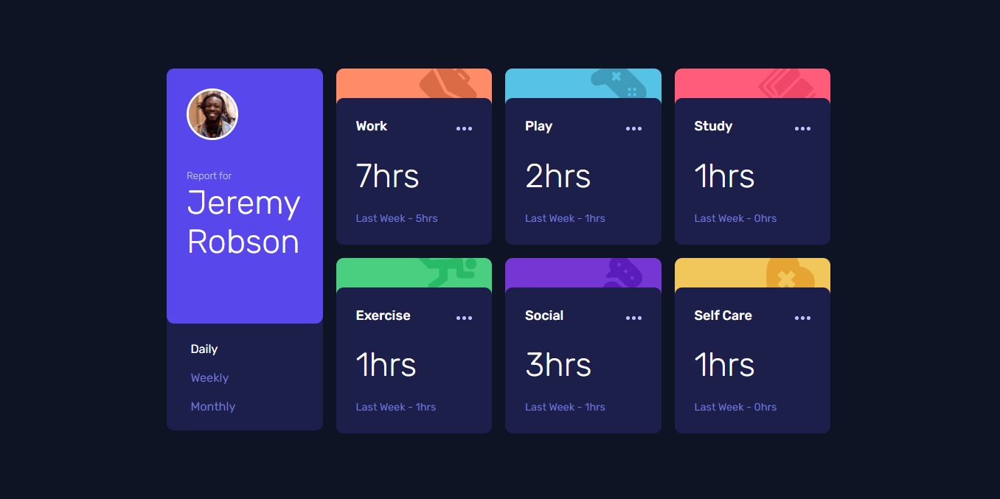
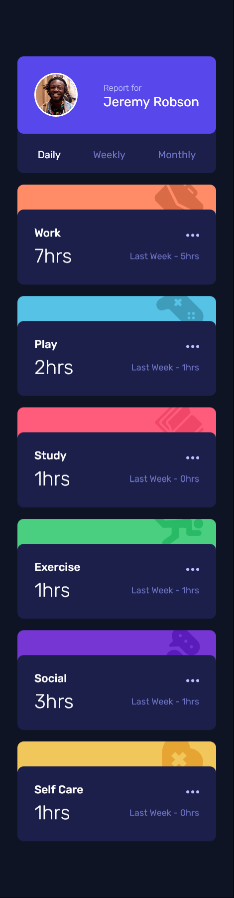

# Frontend Mentor - Time tracking dashboard solution

This is a solution to the [Time tracking dashboard challenge on Frontend Mentor](https://www.frontendmentor.io/challenges/time-tracking-dashboard-UIQ7167Jw). Frontend Mentor challenges help you improve your coding skills by building realistic projects. 

## Table of contents

- [Frontend Mentor - Time tracking dashboard solution](#frontend-mentor---time-tracking-dashboard-solution)
  - [Table of contents](#table-of-contents)
  - [Overview](#overview)
    - [The challenge](#the-challenge)
    - [Screenshot](#screenshot)
    - [Links](#links)
  - [My process](#my-process)
    - [Built with](#built-with)
    - [What I learned](#what-i-learned)
    - [Continued development](#continued-development)
  - [Author](#author)

**Note: Delete this note and update the table of contents based on what sections you keep.**

## Overview

### The challenge

Users should be able to:

- View the optimal layout for the site depending on their device's screen size
- See hover states for all interactive elements on the page
- Switch between viewing Daily, Weekly, and Monthly stats

### Screenshot

**Desktop View**
 

**Mobile View**

 

### Links

- Solution URL: [Github](https://github.com/gylim0604/FrontEnd-Mentor-time-tracking-dashboard)
- Live Site URL: [Vercel](https://front-end-mentor-time-tracking-dashboard.vercel.app/)

## My process

### Built with

- [Next.js](https://nextjs.org/) - React framework
- SCSS
- CSS Grid

### What I learned

Had a chance to practice my React Skills. Got to understand how the React Context Api works abit better. I think the biggest part about this challenge was basically the state management. 

Honestly a bit late writing this README so I don't really remember all the things I had to figure out. 

### Continued development

I might further develop or built off this design to make it into an actual time tracker with profiles and user input and stuff just for my own personal use. Seems like it would be fun to try to set up a backend to store all those data and actually get a functional product.

## Author
- Frontend Mentor - [@gylim0604](https://www.frontendmentor.io/profile/gylim0604)
